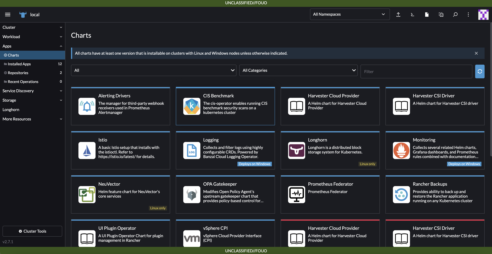

# No-Code Deployment of Rancher Kubernetes on AWS GovCloud

### Table of Contents

* [Introduction](#introduction)
* [Challenges with Kubernetes](#challenges-with-kubernetes)
* [Why Rancher on AWS](#why-rancher-on-aws)
* [No-Code Deployment](#no-code-deployment)
* [Cloud Native Options](#cloud-native-options)
* [What's Next?](#what-s-next-)

## Introduction

Over the last few years, Kubernetes has revolutionized the world of infrastructure and application distribution. From bare-metal servers to virtual machines to containers, Kubernetes has caused teams to re-evaluate their entire technology stack, in the best way possible. However, for many teams Kubernetes remains a very tall mountain to cross. Let's take a look at the infrastructure side of things.

## Challenges with Kubernetes

Most teams start off in the world of clusters and containers and quickly realize the complexity of the configuration, management, and deployment. From service meshes to ingress controllers to deployments to registries and more, Kubernetes is not as simple as it seems. OpsRamp has a great [chapter](https://www.opsramp.com/guides/why-kubernetes/challenges-with-kubernetes/) about all the challenges. Teams start to get overwhelmed with all the decisions points that comes with Kubernetes. There are almost TOO many options out there. Teams start exploring open-source tools, enterprise tools, or start diving down the deep dark path of internal development. Does your team reallywant to take on the technical debt of managing Kubernetes locally and forking the upstream? 

For our teams, we have always wanted to have balance between the workload, the features, and of course, the total cost. Thankfully there are many managed Kubernetes or Kubernetes-As-A-Service offerings. As an industry, we keep seeing the numbers shift away from self-managed Kubernetes to managed Kubernetes. Here's where we can start to talk about how much easier the implementation and management of Kubernetes can be for your team.

But there are trade offs... One thing to think about is the skill set needed to deploy an identical Kubernetes cluster at the edge, in the cloud, or air gapped. The ability to have a flexible deployment module is very valuable for these types of scenarios. Another thing to consider is your temporary (demo), development, or test clusters. Being able to rapidly prototype an on-premise cluster in the cloud can greatly improve velocity for all the teams. Another thing to think about is vendor requirements and lock-ins. Some of the cloud providers charge to get your data out. So how can we have the best of both worlds? By deploying a Kubernetes distribution, that you can take anywhere and everywhere, to a cloud environment.

## Why Rancher on AWS

Rancher is rapidly becoming the Kubernetes of choice for every agency and company. The Rancher stack has some very good choices for all the different layers of infrastructure. Rancher, as a stack, is completely malleable. Meaning you can pick and choose which piece you want to run when and where. This gives greater flexibility to engineering the right infrastructure at the right time for the right location. The Rancher stack can be deployed anywhere. We have deployments from every cloud provider down to the tactical edge. In addition the Rancher stack is open-source. This is important for better transparency for security and code quality. Sound good, how about a "No-Code" deployment of the stack? Rancher Government Solutions ([RGS](https://ranchergovernment.com/)) worked with [AWS](https://aws.amazon.com/) to develop a marketplace offering to dramatically reduce the barrier to entry. The offering is a fully-HA free trial of RKE2 and Rancher Manager by Rancher Government Solutions([RGS](https://ranchergovernment.com/)), designed for US Federal Customers.

## No-Code Deployment

Seriously. It's zero code, zero configuration, and zero hassle. But what do we get?

* Rancher Kubernetes Engine ([RKE2](https://www.rancher.com/products/rke)), which is a fully CNCF comformant Kubernetes distribution, focusing on security and compliance within the government and public sectors.
* Rancher Multi-Cluster Manager ([MCM](https://www.rancher.com/products/rancher)), which is the leading open source platform for running Kubernetes in any environment, with over one billion in total downloads.
* For Amazon AWS... Virtual Private Cloud ([VPC](https://aws.amazon.com/vpc/)), Elastic Compute ([EC2](https://aws.amazon.com/ecs/)), Elastic Load Balancer ([ELB](https://aws.amazon.com/elasticloadbalancing/)), Route 53 ([DNS](https://aws.amazon.com/route53/)), Identity Access Management ([IAM](https://aws.amazon.com/iam/)), and Auto Scaling ([AS](https://aws.amazon.com/autoscaling/)).

Here is an architecture overview of the deployment.

There are a few options and variables you need to set, but behind the scenes, it's a Amazon AWS Cloud Formation ([CF](https://aws.amazon.com/cloudformation/)) template. Currently, it's available at **http://tryranchergov.com** and ready to deploy in the Amazon AWS GovCloud ([US](https://aws.amazon.com/govcloud-us/?whats-new-ess.sort-by=item.additionalFields.postDateTime&whats-new-ess.sort-order=desc)) regions of **us-gov-east-1** and **us-gov-west-1**. Let's walk through the steps.

* Click "Continue to Subscribe"
* Click "Accept the Terms"
* Click "Continue to Configuration"
* Select your options and regions. Click "Continue to Launch"
* Verify Options. Click "Launch"
* Signin to your AWS GovCloud Account.
* Enter all the AWS specific items, like keys, tokens, domain names and others.

Here's the complete process:

**a few moments later and with a handful of clicks...** we have a fully deployed, configured, and highly available Rancher Kubernetes Cluster (RKE2) with Rancher Multi-Cluster Manager (MCM). There are endless reasons to why a low barrier to entry is important for our teams. 

Now that we have this deployed, let's take a look around! The Rancher Manager has a ton of great features such as the application catalog and the continuous delivery tool known as Fleet. Fleet is great way to intergrate GitOPS into Kubernetes with no extra software and with little effort!

Here's a quick overview:

## Cloud Native Options

We understand there are alternatives out there. There are dozens of Kubernetes distributions and platforms in the Cloud Native Computing Foundation ([CNCF](https://landscape.cncf.io/card-mode?category=certified-kubernetes-distribution&grouping=category)). It is a good idea to lean towards the open-source versions. Here is the landscape of open-source distributions sorted by stars (aka popularity).

Clearly, there are some obvious leaders here. When reviewing a managed Kubernetes solution, Amazon Elastic Kubernetes Service ([EKS](https://aws.amazon.com/eks/)) stands out as the best option. [AWS](https://aws.amazon.com/) has been a leader in the cloud ecosystem for years and years. One clear advantage of using [Amazon EC2](https://aws.amazon.com/ecs/) over [Amazon EKS](https://aws.amazon.com/eks/) is the fact that it is virtual machine (VM) platform that provides redundancy with region specific datacenters. This allows you to have a ton of flexibility to deploy what you need, where you need it.

## What's Next?

After exploring and taking advantage of the No-Code Deployment of the Rancher Stack, you can see there are a ton of options are available to you. In our experience, the typical next steps start with deploying workloads (applications) and investigating infrastructure strategies. The Rancher Manager (MCM) has the application catalog to help in that journey. We would recommend deploying the "Monitoring Stack" as a great place to start. If you have existing clusters, the Rancher Manager (MCM) has the ability to leverage its features by importing those clusters.

For investigating infrastructure strategies and exploring Kubernetes, the team at [Rancher Government Solutions](https://ranchergovernment.com/about-rancher-government-solutions) is uniquely positioned to help. Rancher Government Solutions has the experience and history within the government and public sectors and has been improving the security posture of the Rancher Stack for years. RGS has the pleasure of guiding our government and public sectors customers in deploying the Rancher Stack, anywhere and everywhere, leaving you to focus on your mission. Combining [Amazon AWS](https://aws.amazon.com/) and [Rancher](https://rancher.com/), with the assistance of Rancher Government Solutions ([RGS](https://ranchergovernment.com/)) creates a force multiplier. Please reach out to see how we can extend this experience to your mission.

